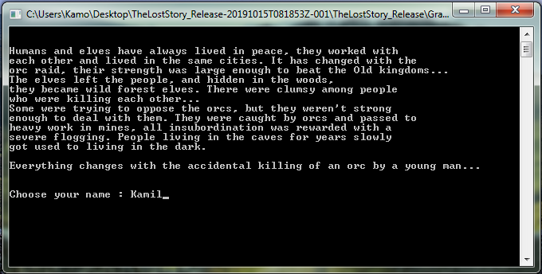
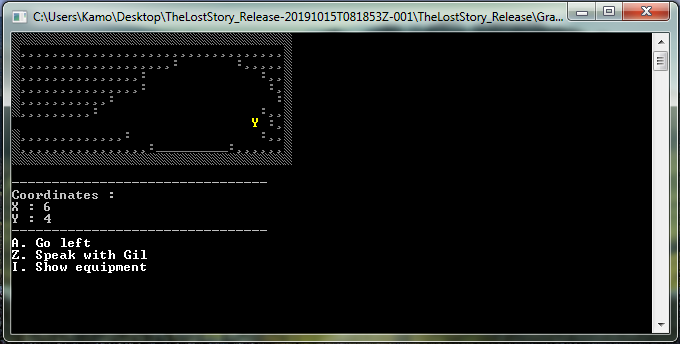
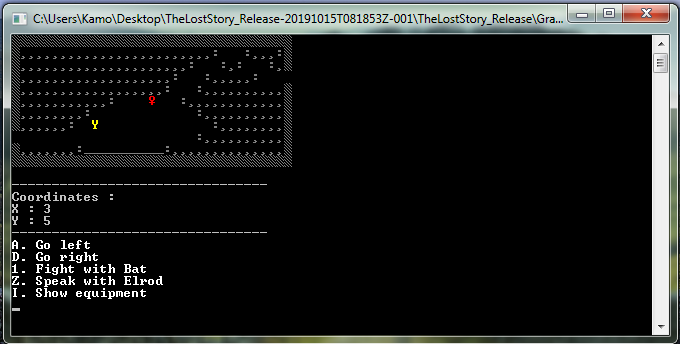
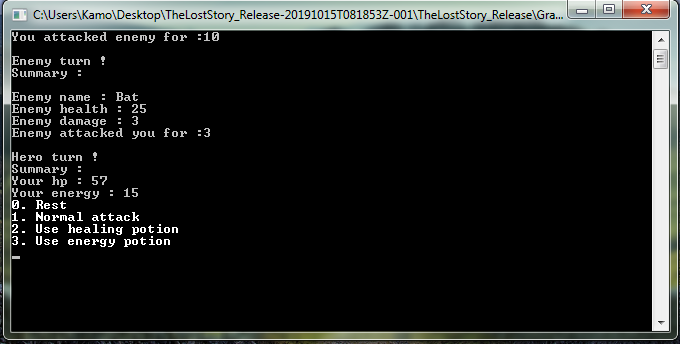
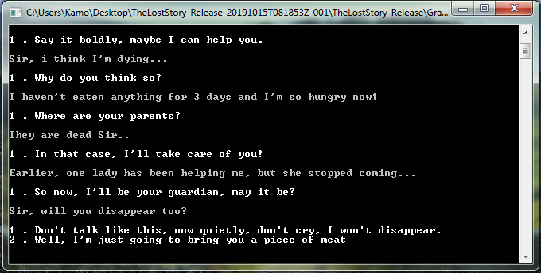

Gra stworzona przeze mnie na konkurs programistyczny Erasmus+.

Łamie każdą zasadę programowania kiedykolwiek wymyśloną, a jednak wszystko działa :D.

Ludzie i elfy od zawsze żyli w pokoju, współpracowali ze sobą i mieszkali we wspólnych miastach. Zmieniło się to jednak wraz z najazdem orków, ich siła była zbyt duża, by stare królestwa mogły się im przeciwstawić ... elfy zostawiły ludzi na pastwę losu, kryjąc się w lasach, zdziczały i stały się leśnymi elfami wrogo nastawionymi do ludzi.
Zaczęły się kłótnie wśród ludzi, którzy zabijali siebie wzajemnie. Niektórzy probowali się przeciwstawić orkom, ale ci szybko dawali sobie z nimi rade. Zdziesiątkowani byli łapani przez orków i zapędzani do ciężkich robot w kopalniach, wszelka niesubordynacja była nagradzana sroga chłosta. Ludzie mieszkający w podziemiach latami powoli
przyzwyczajają się do życia w ciemnościach. Wszystko zmienia się wraz z przypadkowym zabiciem orka przez pewnego młodzieńca ...

Jeden commit, jako że nie wiedziałem wtedy nic o gicie.

------------------------------------------------

Game I created for Erasmus+ coding competiton.

Breakes every rule of programing ever created, yet fully works :D

Humans and elves have always lived in peace, they worked with
each other and lived in the same cities. It has changed with the
orc raid, their strength was large enough to beat the Old kingdoms...
The elves left the people, and hidden in the woods,
they became wild forest elves. There were clumsy among people
who were killing each other... 
Some were trying to oppose the orcs, but they weren't strong 
enough to deal with them. They were caught by orcs and passed to
heavy work in mines, all insubordination was rewarded with a 
severe flogging. People living in the caves for years slowly 
got used to living in the dark. 
Everything changes with the accidental killing of an orc by a young man... 

One commit as i didnt know what git was at the time

--------------------------------

Screenshots

